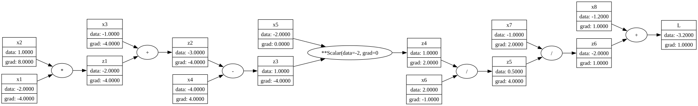

# coregrad

A minimal, mathematically explicit reverse-mode automatic differentiation engine operating on scalar-valued computational graphs. The system constructs a dynamic directed acyclic graph (DAG) during the forward evaluation pass and evaluates exact analytical gradients through localized topological backpropagation.

`coregrad` is engineered strictly for foundational deep learning systems research, architectural prototyping, and algorithmic verification of gradient propagation dynamics at the atomic (scalar) level.

---

## Theoretical Foundations

### Reverse-Mode Automatic Differentiation

For a scalar-valued objective function (or loss) $L: \mathbb{R}^n \to \mathbb{R}$ evaluated over a sequence of intermediate computational nodes, automatic differentiation systematically evaluates the partial derivatives $\frac{\partial L}{\partial x_i}$ for all inputs $x_i$.

Reverse-mode automatic differentiation executes this in two phases:

1. **Forward Pass:** Computes the numerical value of each node along the execution trace.
2. **Backward Pass:** Traverses the computational graph in reverse topological order, applying the chain rule of calculus.

### The Chain Rule and Local Gradient Accumulation

Given an intermediate node $z$ that serves as an input to a subsequent node $u$, the total derivative of the objective function $L$ with respect to $z$ is accumulated across all its outgoing paths:

$$\frac{\partial L}{\partial z} = \sum_{u \in \text{Children}(z)} \frac{\partial L}{\partial u} \cdot \frac{\partial u}{\partial z}$$

Where $\frac{\partial u}{\partial z}$ represents the **local gradient** defined entirely by the mathematical operation generating $u$. In `coregrad`, nodes accumulate gradients in-place ($\mathit{grad} \leftarrow \mathit{grad} + \delta$), resolving multi-path dependencies and correctly evaluating multivariate expressions without redundant computation.

---

## Analytical Verification: Manual vs. Computational Trace

To verify the mathematical validity of the engine, we evaluate a complex composite expression $L = f(x_1, x_2, \dots, x_8)$ using an intermediate structural sequence $Z$.

### 1. Primal Evaluation (Forward Pass)

Given the boundary conditions:


$$x_1 = -2, \quad x_2 = 1, \quad x_3 = -1, \quad x_4 = -4, \quad x_5 = -2, \quad x_6 = 2, \quad x_7 = -1, \quad x_8 = -1.2$$

The computational execution trace progresses sequentially:

$$\begin{aligned}
z_1 &= x_1 \cdot x_2 = (-2) \cdot 1 = -2 \
z_2 &= z_1 + x_3 = (-2) + (-1) = -3 \
z_3 &= z_2 - x_4 = (-3) - (-4) = 1 \
z_4 &= z_3^{x_5} = 1^{-2} = 1 \
z_5 &= \frac{z_4}{x_6} = \frac{1}{2} = 0.5 \
z_6 &= \frac{x_7}{z_5} = \frac{-1}{0.5} = -2 \
L &= z_6 + x_8 = (-2) + (-1.2) = -3.2
\end{aligned}$$

---

### 2. Adjoint Propagation (Backward Pass)

Applying reverse-mode automatic differentiation starting from the objective boundary condition $\frac{\partial L}{\partial L} = 1$, the analytical gradients are propagated downstream through strict, isolated vertical resolutions:

$$\frac{\partial L}{\partial z_6} = 1.0$$

$$\frac{\partial L}{\partial x_8} = 1.0$$

$$\frac{\partial L}{\partial x_7} = \frac{\partial L}{\partial z_6} \cdot \frac{\partial z_6}{\partial x_7} = 1 \cdot \frac{1}{z_5} = \frac{1}{0.5} = 2.0$$

$$\frac{\partial L}{\partial z_5} = \frac{\partial L}{\partial z_6} \cdot \frac{\partial z_6}{\partial z_5} = 1 \cdot \left(-\frac{x_7}{z_5^2}\right) = -\frac{-1}{0.5^2} = 4.0$$

$$\frac{\partial L}{\partial z_4} = \frac{\partial L}{\partial z_5} \cdot \frac{\partial z_5}{\partial z_4} = 4 \cdot \frac{1}{x_6} = \frac{4}{2} = 2.0$$

$$\frac{\partial L}{\partial x_6} = \frac{\partial L}{\partial z_5} \cdot \frac{\partial z_5}{\partial x_6} = 4 \cdot \left(-\frac{z_4}{x_6^2}\right) = 4 \cdot \left(-\frac{1}{2^2}\right) = -1.0$$

$$\frac{\partial L}{\partial z_3} = \frac{\partial L}{\partial z_4} \cdot \frac{\partial z_4}{\partial z_3} = 2 \cdot \left(x_5 \cdot z_3^{x_5 - 1}\right) = 2 \cdot \left(-2 \cdot 1^{-3}\right) = -4.0$$

$$\frac{\partial L}{\partial x_5} = \frac{\partial L}{\partial z_4} \cdot \frac{\partial z_4}{\partial x_5} = 2 \cdot \left(z_4 \cdot \ln(z_3)\right) = 2 \cdot (1 \cdot \ln(1)) = 0.0$$

$$\frac{\partial L}{\partial z_2} = \frac{\partial L}{\partial z_3} \cdot \frac{\partial z_3}{\partial z_2} = -4 \cdot 1 = -4.0$$

$$\frac{\partial L}{\partial x_4} = \frac{\partial L}{\partial z_3} \cdot \frac{\partial z_3}{\partial x_4} = -4 \cdot (-1) = 4.0$$

$$\frac{\partial L}{\partial z_1} = \frac{\partial L}{\partial z_2} \cdot \frac{\partial z_2}{\partial z_1} = -4 \cdot 1 = -4.0$$

$$\frac{\partial L}{\partial x_3} = \frac{\partial L}{\partial z_2} \cdot \frac{\partial z_2}{\partial x_3} = -4 \cdot 1 = -4.0$$

$$\frac{\partial L}{\partial x_1} = \frac{\partial L}{\partial z_1} \cdot \frac{\partial z_1}{\partial x_1} = -4 \cdot x_2 = -4 \cdot 1 = -4.0$$

$$\frac{\partial L}{\partial x_2} = \frac{\partial L}{\partial z_1} \cdot \frac{\partial z_1}{\partial x_2} = -4 \cdot x_1 = -4 \cdot (-2) = 8.0$$

---

### 3. Verification Matrix

The analytical derivations match the absolute numerical outputs evaluated by the `coregrad` execution engine:

| Graph Node ($v$) | Primal Value ($v.\mathit{data}$) | Adjoint Gradient ($v.\mathit{grad}$) |
| --- | --- | --- |
| **$x_1$** | -2.0000 | -4.0000 |
| **$x_2$** | 1.0000 | 8.0000 |
| **$x_3$** | -1.0000 | -4.0000 |
| **$x_4$** | -4.0000 | 4.0000 |
| **$x_5$** | -2.0000 | 0.0000 |
| **$x_6$** | 2.0000 | -1.0000 |
| **$x_7$** | -1.0000 | 2.0000 |
| **$x_8$** | -1.2000 | 1.0000 |
| **$z_1$** | -2.0000 | -4.0000 |
| **$z_2$** | -3.0000 | -4.0000 |
| **$z_3$** | 1.0000 | -4.0000 |
| **$z_4$** | 1.0000 | 2.0000 |
| **$z_5$** | 0.5000 | 4.0000 |
| **$z_6$** | -2.0000 | 1.0000 |
| **$L$** | -3.2000 | 1.0000 |

### Derived Computational Graph Structure

The verified execution trace matches the exact topological resolution mapped below:


---

## Core Operations

The `Scalar` abstraction overloads standard Python magic methods to construct dynamic dependencies using internal pointer metadata (`_prev` and `_op`).

| Mathematical Operation | Operator Overload | Local Gradient Activation Primitive ($\Delta = \text{out}.\mathit{grad}$) |
| --- | --- | --- |
| **Addition** | `a + b` | $\frac{\partial L}{\partial a} \mathrel{+}= \Delta, \quad \frac{\partial L}{\partial b} \mathrel{+}= \Delta$ |
| **Subtraction** | `a - b` | $\frac{\partial L}{\partial a} \mathrel{+}= \Delta, \quad \frac{\partial L}{\partial b} \mathrel{-}= \Delta$ |
| **Multiplication** | `a * b` | $\frac{\partial L}{\partial a} \mathrel{+}= b \cdot \Delta, \quad \frac{\partial L}{\partial b} \mathrel{+}= a \cdot \Delta$ |
| **Division** | `a / b` | $\frac{\partial L}{\partial a} \mathrel{+}= \frac{1}{b} \cdot \Delta, \quad \frac{\partial L}{\partial b} \mathrel{+}= \left(-\frac{a}{b^2}\right) \cdot \Delta$ |
| **Power Scaling** | `a ** b` | $\frac{\partial L}{\partial a} \mathrel{+}= \left(b \cdot a^{b-1}\right) \cdot \Delta$ |
| **Hyperbolic Tangent** | `a.tanh()` | $\frac{\partial L}{\partial a} \mathrel{+}= \left(1 - \tanh^2(a)\right) \cdot \Delta$ |

---

## Implementation & Usage

The following verification script demonstrates primal structural mapping, reverse execution initialization via `.backward()`, and topological adjoint propagation across a single neuron optimization checkpoint.

```python
from coregrad.engine import Scalar

# Weights initialization
w1 = Scalar(-0.34, var_name="w1")
w2 = Scalar(0.67, var_name="w2")

# Bias initialization
b = Scalar(-1, var_name="b")

# Input boundary conditions
x1 = Scalar(-2, var_name="x1")
x2 = Scalar(-0.3, var_name="x2")

# Forward Pass Execution Trace
z1 = w1 * x1; z1.var_name = "z1"
z2 = w2 * x2; z2.var_name = "z2"
z3 = z1 + z2; z3.var_name = "z3"
z4 = z3 + b; z4.var_name = "z4"
y = z4.tanh(); y.var_name = "y"

# Adjoint Propagation initialization
y.backward()

# Inspection of evaluated analytical gradients
print(f"Logit Gradient (dy/dy): {y.grad}")
print(f"Weight 1 Gradient (dy/dw1): {w1.grad}")
print(f"Weight 2 Gradient (dy/dw2): {w2.grad}")
print(f"Bias Gradient (dy/db): {b.grad}")

```

---

## Downstream Application Extensions

To verify the optimization capability of this scalar engine within high-dimensional non-linear spaces, an empirical implementation of a deep feedforward network classifier was constructed.

The accompanying repository evaluates `coregrad` on the standard MNIST digit classification task, verifying optimization stability under standard batch stochastic gradient descent (SGD).

* **MNIST Digit Classifier Experimentation Pipeline:** [https://github.com/himanshu-singh/coregrad-mnist](https://www.google.com/search?q=https://github.com/himanshu-singh/coregrad-mnist) *(Placeholder - Update upon publication)*

---

## Author

**Himanshu Singh** Research Engineer

*Year: 2026*